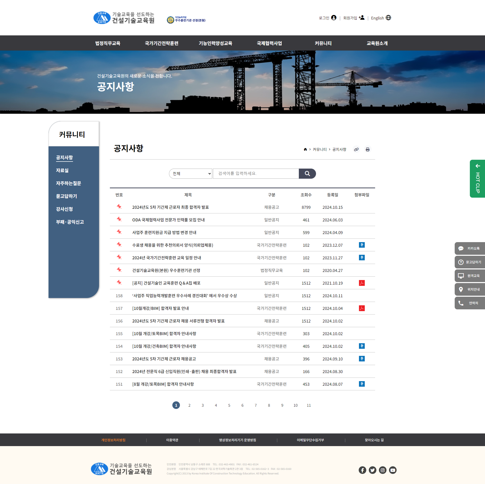

   
  
   
  <h1>공공기관 리뉴얼</h1>
  
   

## 목차

1. **기술 스택**
2. **주요 기능**
3. **주요 페이지**

 

## 🛠 기술 스택

**Front-end**

-   
  

**Design**

- 

**ETC**

- 

 

## 💡 주요 기능

- Swiper Slide
- Pagination
- Accordion
- Tab / Tab in Tab

 

## 📄 주요 페이지

|                               메인 페이지                               |                               메인 페이지 - 모바일                      |                               서브 페이지 - 메인                         |                               서브 페이지 - 테블릿                              |                               서브 페이지 -모바일                               |
| :---------------------------------------------------------------------: | :---------------------------------------------------------------------: | :---------------------------------------------------------------------: | :---------------------------------------------------------------------: | :---------------------------------------------------------------------: |
|  |  |  |  |  |

 

